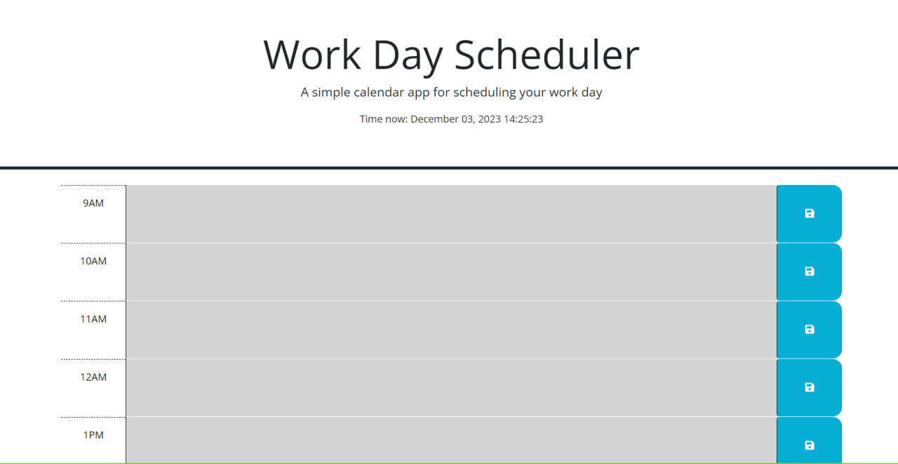
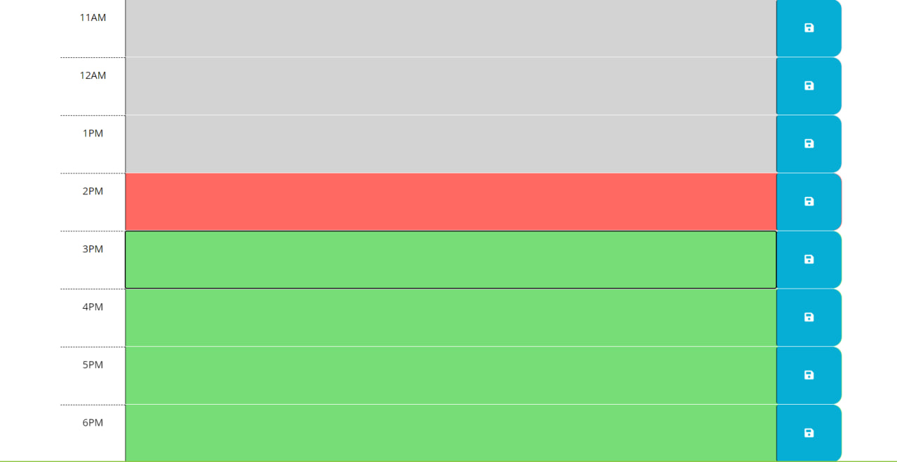

# Schedule-Work-Day
Modifying existing web app  Work Day Scheduler

## Description

I wanted to adjust existing calendar application, so I can add some fuctionality to it. I added changing color at time blocks section depending what time is now. Also, I  added a function to store my input in box to local storage when I click the save button.

## Table of Contets

- [Screenshots](#screenshots)
- [Links](#links)

## Screenshots

In this section I provided screenshots of the Deployed Website Application.

## Links

In this section I added links to the deployed application and to the GitHub repositories with the original codebase and modified code.

Deployed application
    https://mykhailozakh.github.io/Schedule-Work-Day/

Project Repository
    https://github.com/MykhailoZakh/Schedule-Work-Day

Original code Repository
    https://github.com/coding-boot-camp/crispy-octo-meme